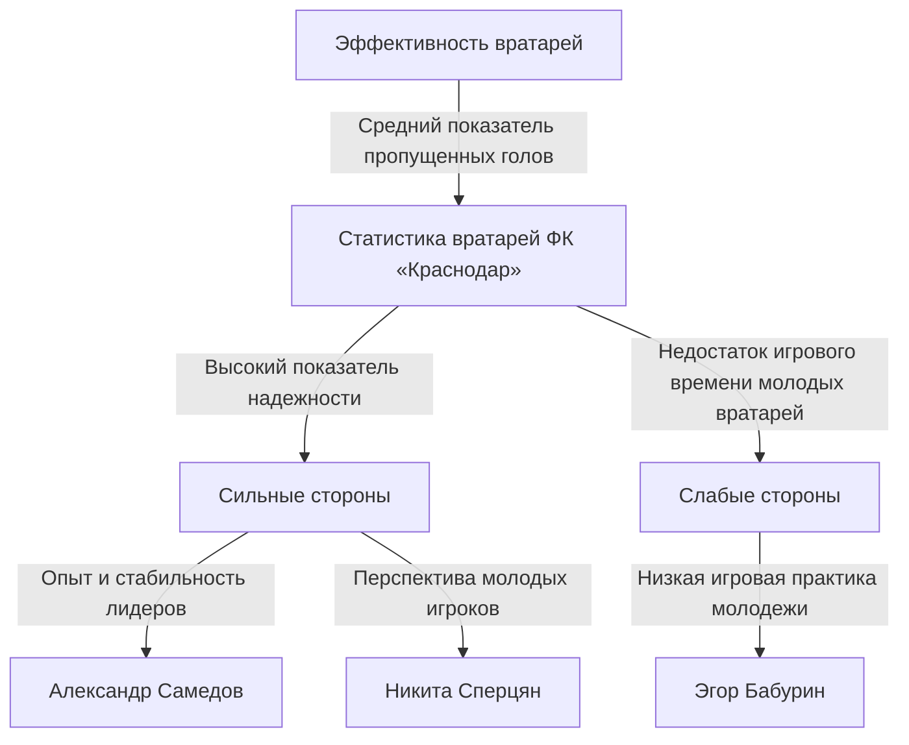

# Диаграммы по запросу: Охарактеризуй слабые и сильные стороны основных игроков фк "Краснодар"

_Сгенерировано: 2026-10-07 22:33:38_

---

None
The above Mermaid diagram illustrates the strengths and weaknesses of FC Krasnodar's goalkeepers based on their performance statistics and development opportunities for young players.