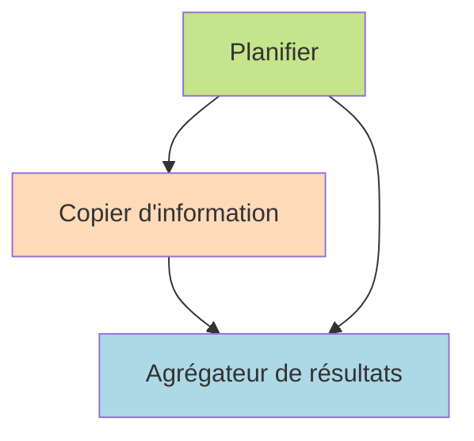

# Диаграммы по запросу: Как устроен GPT Researcher

_Сгенерировано: 2026-10-09 19:30:45_

---

This Mermaid diagram represents the multi-agent architecture of GPT Researcher, showing the interaction between the planner, information gatherers, and aggregator agent.