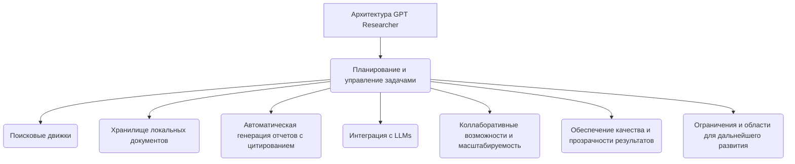

# Диаграммы по запросу: Как устроен GPT Researcher

_Сгенерировано: 2026-10-09 19:44:55_

---

```mermaid
graph TD
    A[Архитектура GPT Researcher] --> B(Планирование и управление задачами)
    B --> C(Поисковые движки)
    B --> D(Хранилище локальных документов)
    B --> E(Автоматическая генерация отчетов с цитированием)
    B --> F(Интеграция с LLMs)
    B --> G(Коллаборативные возможности и масштабируемость)
    B --> H(Обеспечение качества и прозрачности результатов)
    B --> I(Ограничения и области для дальнейшего развития)
```